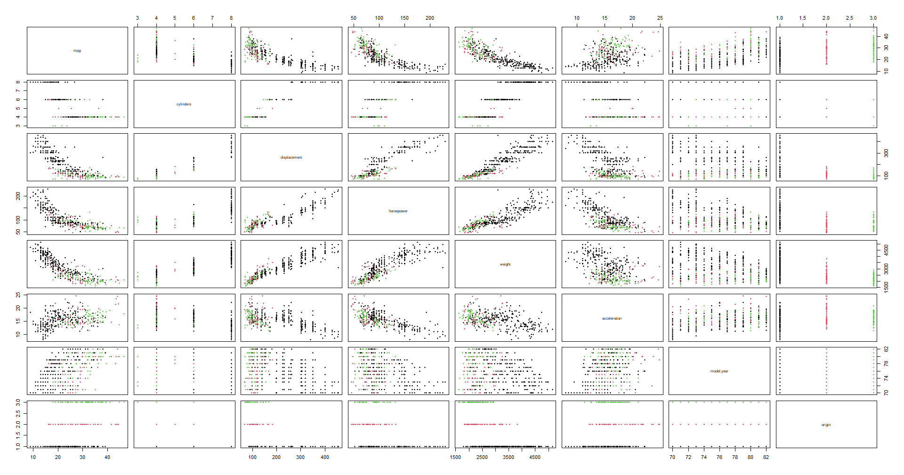
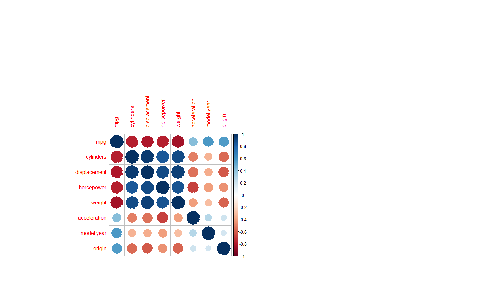
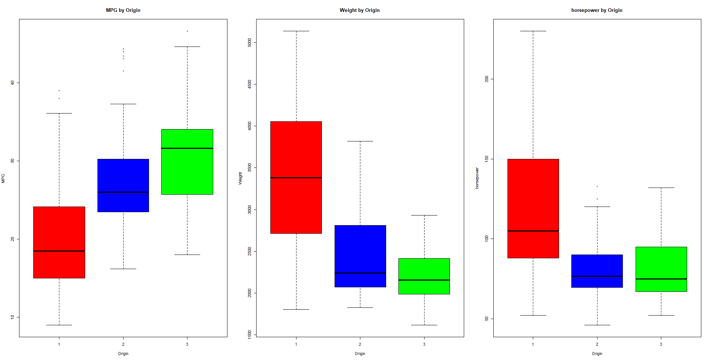
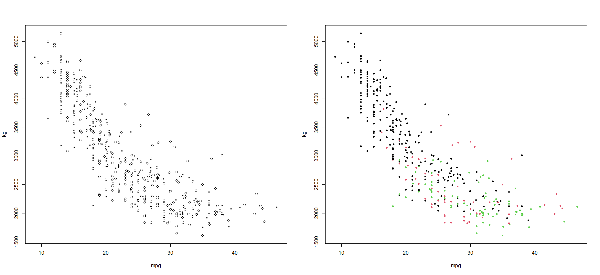
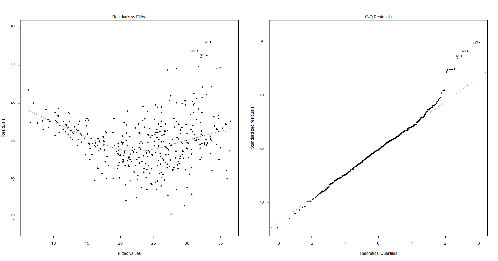

# Data Analysis Introduction

This repository contains class materials and R scripts for the Data Analysis Introduction course.

## Directory Structure
- **Data/**: Contains common datasets used across multiple sessions.
- **Week1 - Week7**: Contains scripts and exercises for each weekly session.
- **FinalReport**: Materials for the final report.
- **R/**: Additional R resources.

## Scripts
R scripts are organized by week. They read data from the `Data/` directory.

## Notes
- Student IDs have been removed from filenames and code for privacy.
- Japanese filenames have been renamed to English for consistency.

# 自動車の燃費（MPG）要因分析：1970〜80年代データを用いた重回帰分析
[cite_start]**2024年度 データ解析序説 期末レポート課題 [cite: 1]**

## 1. プロジェクト概要
[cite_start]1970年代後半から1980年代初頭の自動車燃費に関するデータ（Auto MPG dataset）を使用し、自動車の諸元が燃費（mpg）に与える影響を統計的に分析しました [cite: 5]。

### 目的
* [cite_start]自動車のエンジン性能、重量、形式が燃費にどのように影響するかを解明する [cite: 5]。
* [cite_start]重要な変数のみを抽出し、燃費を算出するための実用的でシンプルなモデルを構築する [cite: 7]。

### 予想
* [cite_start]日本製造、軽量、かつシリンダー数が少ない車ほど燃費が良いと予測 [cite: 6]。

---

## 2. 使用データ
* [cite_start]**データソース**: [UCI Machine Learning Repository - Auto MPG](https://archive.ics.uci.edu/dataset/9/auto+mpg) [cite: 5]
* [cite_start]**目的変数**: `mpg` (燃費) [cite: 5]
* [cite_start]**説明変数**: シリンダー数、排気量、馬力、重量、加速、モデル年式、製造国 [cite: 5]

---

## 3. 分析プロセス

### ① 探索的データ解析 (EDA)
相関行列プロットとボックスプロットを用いてデータの全体像を把握しました。
* [cite_start]**相関分析**: 重量と排気量は強い負の相関、年式と製造国は正の相関が確認されました [cite: 20]。
* [cite_start]**地域特性**: アメリカ車は日本やヨーロッパ車に比べ、大排気量で重量が重い傾向にあります [cite: 32, 33]。

### ② 重回帰分析
[cite_start]全変数を用いた回帰分析（R値 = 0.82）の結果、以下の変数が有意であることが判明しました [cite: 39, 42, 51]：
* **排気量 (displacement)**
* **重量 (weight)**
* **モデル年式 (year)**
* **製造国 (origin)**

### ③ モデル最適化 (AICによる変数選択)
[cite_start]ステップワイズ法（変数増減法）を用いて、赤池情報量基準 (AIC) に基づき最適なモデルを選択しました [cite: 73, 76]。
[cite_start]結果として、以下のシンプルかつ実用的なモデルが導出されました [cite: 74]。

[cite_start]**モデル式:** `mpg ~ weight + year + origin` [cite: 73, 84]

[cite_start]**モデル式:** `mpg ~ weight + year + origin` [cite: 73, 84]

---

## 4. 分析結果と考察

### 最終結論
[cite_start]分析の結果、燃費を決定する主要な要因は **「重量」「年式」「製造国」** でした [cite: 86, 89]。

### 考察：シリンダー数の影響
[cite_start]当初の予想に反し、シリンダー数は最終的なモデルに有意な影響を与えませんでした [cite: 86, 90]。
* [cite_start]**推論**: シリンダー数は重量と強い相関（比例関係）にあるため、重量という変数にその影響が内包されていると考えられます [cite: 94, 95]。

### 外れ値の分析
[cite_start]残差プロットの分析により、VW Rabbit (diesel) などのディーゼル車が外れ値として検出されました [cite: 60, 71][cite_start]。これらは「軽量かつディーゼルエンジン」という特性により、通常のモデルから逸脱した高い燃費性能を示しています [cite: 71]。

---

## 5. 今後の展望
* [cite_start]2000年代以降のより新しい自動車データを用いた再分析 [cite: 91, 97]。
* [cite_start]スポーツ関連データなど、他分野のデータ収集と多角的な分析への応用 [cite: 97]。

---

## 著者
* [cite_start]**氏名**: 峰 康介 [cite: 3]
